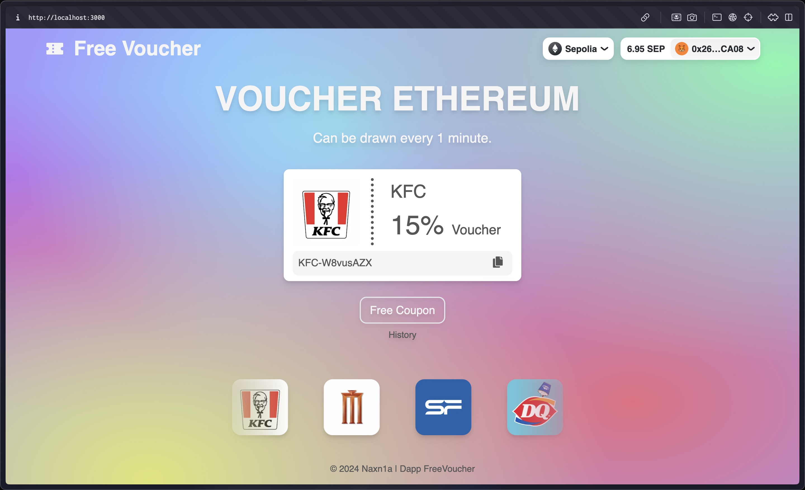

# Dapp Free Voucher



## Getting Started

```bash
npm run dev
# or
yarn dev
# or
pnpm dev
# or
bun dev
```

Note: Every dApp that relies on WalletConnect now needs to obtain a `projectId` from [WalletConnect](https://cloud.walletconnect.com/sign-in) Cloud. This is absolutely free and only takes a few minutes.

## Dotenv

```
BASEURL= {host}
PROJECTID= {projectid}
DATABASE_URL= {database_url}
```

## Prisma

```bash
npx prisma migrate dev
# or
bunx prisma migrate dev
```

## Contract
Deploy smart contract and config `address`, `abi` and edit file Voucher.json
```bash
cd src/app/contracts/
```